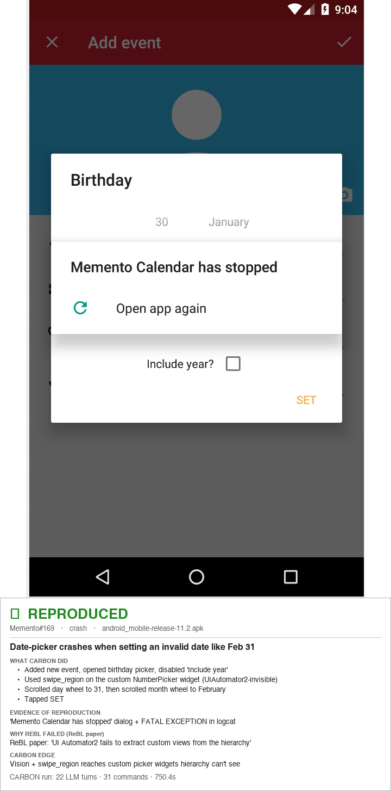
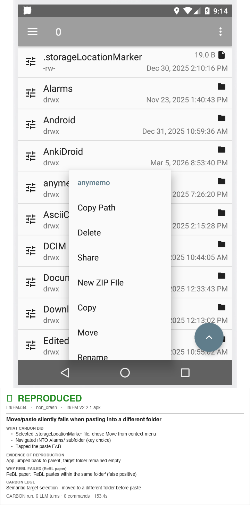

# CARBON

**Contextual Automated Reproduction of Bugs on Android**

CARBON is an LLM-driven system for automatically reproducing Android bug reports. It connects to an Android emulator, captures annotated screenshots with color-coded bounding boxes, and uses Gemini 2.5 Pro to iteratively follow bug reproduction steps — including complex gestures like pinch-to-zoom, double-tap, edge swipes, and coordinate-based interactions that previous tools could not handle.

##  Comparison Report: CARBON vs ReBL vs ReActDroid vs AdbGPT

**Total Bugs Evaluated:** 100

## Overall Summary

| Tool | SUCCESS | FAIL | Success Rate |
|------|---------|------|--------------|
| CARBON | 88 | 12 | 88.0% |
| ReBL | 34 | 66 | 34.0% |
| ReActDroid | 5 | 95 | 5.0% |
| AdbGPT | 54 | 46 | 54.0% |

## Per-Category Breakdown

| Category | Bugs | CARBON | ReBL | ReActDroid | AdbGPT |
|----------|------|--------|------|------------|--------|
| Double Tap | 21 | 18/21 | 9/21 | 2/21 | 11/21 |
| Drag & Drop | 9 | 8/9 | 1/9 | 0/9 | 5/9 |
| Long Press | 9 | 8/9 | 2/9 | 0/9 | 3/9 |
| Orientation | 6 | 5/6 | 4/6 | 0/6 | 4/6 |
| Pinch/Zoom | 12 | 12/12 | 1/12 | 0/12 | 7/12 |
| Quick Tap | 7 | 5/7 | 0/7 | 0/7 | 4/7 |
| Scroll | 6 | 6/6 | 3/6 | 2/6 | 3/6 |
| Swipe | 30 | 26/30 | 14/30 | 1/30 | 17/30 |
| *ReBL Failure Challenge Set* | *9* | *7/9* | *0/9* | *—* | *—* |

## Detailed Results

### Double Tap

| Bug ID | App | CARBON | ReBL | ReActDroid | AdbGPT | Screenshot | Remarks | Steps |
|--------|-----|--------|------|------------|--------|------------|---------|-------|
| [FossifyOrg_Calendar_1035](Dataset/double_tap/FossifyOrg_Calendar_1035%20Tested) | FossifyOrg/Calendar | ✅ | ✅ | ✅ | ✅ |  | **Tap/click gesture** → Ap crashes when creating new event | 1. Open app 2. Click on the big + 3. Click on event Then it crashes |
| [FossifyOrg_Calendar_273](Dataset/double_tap/FossifyOrg_Calendar_273%20Tested) | FossifyOrg/Calendar | ✅ | ❌ | ❌ | ✅ |  | **Double-tap gesture** → Setting a default event length doesn't change the default event length | 1. Set default event duration 35 minutes 2. Double tap calendar to make a new event (not using [+] button) |
| [FossifyOrg_Gallery_363](Dataset/double_tap/FossifyOrg_Gallery_363%20Tested) | FossifyOrg/Gallery | ✅ | ✅ | ✅ | ✅ |  | **Double-tap gesture** → webp images when double tapped don't zoom to height of image | 1. Open a .webp images 2. Double tap screen 3. Image doesn't fit to height of screen just zooms in further than edge of image |
| [FossifyOrg_Gallery_584](Dataset/double_tap/FossifyOrg_Gallery_584%20Tested%20F) | FossifyOrg/Gallery | ❌ | ❌ | ❌ | ❌ |  | **Tap/click gesture** → When trying to open some JPG files, the gallery app crashes or returns to the main screen. | 1. Go to any folder with certain photos 2. Click on jpg file 3. The app either crashes or returns to main screen |
| [FossifyOrg_Gallery_678](Dataset/double_tap/FossifyOrg_Gallery_678%20Tested) | FossifyOrg/Gallery | ✅ | ✅ | ❌ | ✅ |  | **Double-tap gesture** → 'Allow 1:1 zooming in with two double taps' not working when pixel size of the photo is lesser than that of… | 1. View a photo that has smaller x/y pixel size than that what the screen has, e.g a photo with 834x700 px. 2. Try to do two double taps (or any kind of taps) and the 1:1 view is not there, it only jumps between full-screen and… |
| [FossifyOrg_Gallery_846](Dataset/double_tap/FossifyOrg_Gallery_846%20Tested) | FossifyOrg/Gallery | ✅ | ❌ | ❌ | ❌ |  | **Double-tap gesture** → "Fill screen" zoom on double tap ignores disabled "Show notch if available" | 1. Disable "Show notch if available" 2. Open an image and double-tap so that the image is zoomed to fill the screen 3. Drag image up/down |
| [FossifyOrg_Gallery_847](Dataset/double_tap/FossifyOrg_Gallery_847%20Tested) | FossifyOrg/Gallery | ✅ | ❌ | ❌ | ✅ |  | **Double-tap gesture** → Invalid "fill screen" zoom for GIF images on double-tap | 1. Open any GIF image 2. Double-tap it |
| [LawnchairLauncher_lawnchair_2910](Dataset/double_tap/LawnchairLauncher_lawnchair_2910%20Tested) | LawnchairLauncher/lawnchair | ✅ | ❌ | ❌ | ❌ |  | **Double-tap gesture** → [BUG] Double tap to sleep no longer works through root access | 1. Enable "suspend" function in gestures 2. Double tap to suspend |
| [LawnchairLauncher_lawnchair_4125](Dataset/double_tap/LawnchairLauncher_lawnchair_4125%20Tested) | LawnchairLauncher/lawnchair | ✅ | ❌ | ❌ | ✅ |  | **Double-tap gesture** → [BUG] android 14, no option to allow restricted setting | 1. Go to - settings, change gestures, double tap to sleep 2. Click on - kebab 3 dot menu, no option to allow restrictive settings 3. See error - Restricted setting |
| [LawnchairLauncher_lawnchair_4786](Dataset/double_tap/LawnchairLauncher_lawnchair_4786%20Tested%20F) | LawnchairLauncher/lawnchair | ❌ | ❌ | ❌ | ✅ |  | **TalkBack + double-tap** → [BUG] Crash when trying to move item using TalkBack action | 1. Hover over a widget 2. With TalkBack enabled, press with 3 fingers to open the actions menu 3. Double-tap the first item in the list, "Actions" |
| [Pool-Of-Tears_GreenStash_170](Dataset/double_tap/Pool-Of-Tears_GreenStash_170%20Tested) | Pool-Of-Tears/GreenStash | ✅ | ❌ | ❌ | ❌ |  | **Accessibility (TalkBack)** → [Bug]: Some accessibility issues | 1. The red boxes in the image below indicate all the UI elements that can be accessed by visually impaired users using… 2. The "Back" button is missing ContentDescriptions. Without content descriptions, users with visual impairments may have… 3. Adding an `onClickLabel` to the Button might also be a good practice. An… |
| [TeamNewPipe_NewPipe_10750](Dataset/double_tap/TeamNewPipe_NewPipe_10750%20Tested) | TeamNewPipe/NewPipe | ✅ | ✅ | ❌ | ❌ |  | **Playback / generic UI** → Video playback randomly "closed/crashed", and content loaded but stuck buffering | 1. Play couple videos. 2. At any moment, the video player might stuck buffering for couple seconds before it crash/close 3. Replay the video, now it stuck buffering, but the frames and stuff is loaded (can be checked by seeking (double tap on… |
| [TeamNewPipe_NewPipe_8338](Dataset/double_tap/TeamNewPipe_NewPipe_8338%20Tested) | TeamNewPipe/NewPipe | ✅ | ❌ | ❌ | ❌ |  | **Double-tap gesture** → Swipe down gesture of Player UI does not work all the times | 1. Keep a video running 2. Double tap video to pause it & immediately try to swipe down ### Expected behavior Player UI should minimize to expose… |
| [abdallahmehiz_mpvKt_184](Dataset/double_tap/abdallahmehiz_mpvKt_184%20Tested) | abdallahmehiz/mpvKt | ✅ | ❌ | ❌ | ✅ |  | **Double-tap gesture** → Tap error while playing video | 1. Go to any video 2. make use of double tap once 3. Then if you single tap on left or right it will move forward or backward or if if accidentally if clicked once in… |
| [ankidroid_Anki-Android_17393](Dataset/double_tap/ankidroid_Anki-Android_17393%20Tested) | ankidroid/Anki-Android | ✅ | ✅ | ❌ | ❌ |  | **Tap/click gesture** → [BUG]: IO Cards Go to the Wrong Deck | 1. Go to **Settings > General**. 2. Click **Deck for new cards** and select `use current deck`. 3. Go back to deck picker and select a deck. |
| [cromaguy_Rhythm_281](Dataset/double_tap/cromaguy_Rhythm_281%20Tested) | cromaguy/Rhythm | ✅ | ✅ | ❌ | ❌ |  | **Tap/click gesture** → [BUG]: Double tap needed on Touch Gestures view of Onboarding Setup | 1. Open the app after fresh install. 2. Follow Setup steps until Touch Gestures. 3. Tap Next Button. |
| [fast4x_RiMusic_1152](Dataset/double_tap/fast4x_RiMusic_1152%20Tested) | fast4x/RiMusic | ✅ | ✅ | ❌ | ✅ |  | **Tap/click gesture** → Unclear Linking and Unresponsive Buttons in Player View | 1. Open the player view. 2. Tap once on the song title or artist name. |
| [gsantner_markor_2746](Dataset/double_tap/gsantner_markor_2746%20Tested) | gsantner/markor | ✅ | ✅ | ❌ | ❌ |  | **Double-tap gesture** → Markor does not recognize URL/link anymore | 1. When I had a link on Markor, I just had to double-tap on the link for Markor to select the entire link. 2. After selecting it, to the left of the three lines, I had the icon of the app that should have opened the link. I… 3. For 10 days, none of this has been working, and I am encountering the problem, so I am… |
| [openboard-team_openboard_613](Dataset/double_tap/openboard-team_openboard_613%20Tested) | openboard-team/openboard | ✅ | ❌ | ❌ | ❌ |  | **Double-tap gesture** → Sometimes the spellchecker flags correctly spelt words if one adds a full-stop to them | 1. Set spellcheck to Openboard. 2. In an SMS client - I use Textra - type `<properly spelt word>.` (manually typing the full-stop, i.e., without using the… 3. See that a spelling mistake is - wrongly - flagged. **Expected behavior** A correctly spelt word should not get flagged… |
| [openboard-team_openboard_758](Dataset/double_tap/openboard-team_openboard_758%20Tested%20F) | openboard-team/openboard | ❌ | ❌ | ❌ | ✅ |  | **TalkBack + double-tap** → Accessibility: The button to go to the previous level does not work properly | 1. Install a screen reader (TalkBack or Jieshuo) on your device. Then - turn on the TalkBack or Jieshuo service in the… 2. open Open Board settings; 3. Go to any settings section; |
| [syt0r_Kanji-Dojo_291](Dataset/double_tap/syt0r_Kanji-Dojo_291%20Tested) | syt0r/Kanji-Dojo | ✅ | ✅ | ❌ | ✅ |  | **Tap/click gesture** → Double-tapping back arrow while transitioning from vocab info to practice skips finish-practice dialog | 1. Start a new practice session and reveal the answer to the letter/vocab card. 2. Navigate to the vocab info screen (e.g. by selecting one of the vocab examples in letter practice, or tapping the… 3. Tap the back arrow in the top app bar. Before the animation finishes, tap the back arrow a second time. |

### Drag & Drop

| Bug ID | App | CARBON | ReBL | ReActDroid | AdbGPT | Screenshot | Remarks | Steps |
|--------|-----|--------|------|------------|--------|------------|---------|-------|
| [FossifyOrg_Launcher_304](Dataset/drag_and_drop/FossifyOrg_Launcher_304%20Tested) | FossifyOrg/Launcher | ✅ | ❌ | ❌ | ✅ |  | **Drag and drop gesture** → Accidently creating invisible folders in dock | 1. Have a app on the bottom right most location on your app dock at home screen. 2. Drag and drop another app or same app onto the bottom right most location where you should already have a app there. 3. Invisible folder is created and takes up that space. |
| [FossifyOrg_Notes_59](Dataset/drag_and_drop/FossifyOrg_Notes_59%20Tested) | FossifyOrg/Notes | ✅ | ❌ | ❌ | ✅ |  | **Drag and drop gesture** → Reordering checklists works strangely with move checked to bottom | (see bug report) |
| [LawnchairLauncher_lawnchair_1247](Dataset/drag_and_drop/LawnchairLauncher_lawnchair_1247%20Tested%20F) | LawnchairLauncher/lawnchair | ❌ | ❌ | ❌ | ❌ |  | **TalkBack action** → the launcher kees crashign when I attempt to move stuff | 1. Make sure launcher is set to launcheer. 2. Hit home and find an item you want to move 3. Bring up the talk back actions menu |
| [LawnchairLauncher_lawnchair_4320](Dataset/drag_and_drop/LawnchairLauncher_lawnchair_4320%20Tested) | LawnchairLauncher/lawnchair | ✅ | ❌ | ❌ | ✅ |  | **Drag and drop gesture** → [BUG] Unable to add any widget | 1. Open "widgets" tab 2. Select any widget 3. Drag and drop it to the home screen |
| [MetrolistGroup_Metrolist_3227](Dataset/drag_and_drop/MetrolistGroup_Metrolist_3227%20Tested) | MetrolistGroup/Metrolist | ✅ | ❌ | ❌ | ❌ |  | **Drag and drop gesture** → Replacement of new song with old song | 1. Add a song to a playlist in custom orde 2. Drag the new song at the bottom to the top of the playlist |
| [MetrolistGroup_Metrolist_3561](Dataset/drag_and_drop/MetrolistGroup_Metrolist_3561%20Tested) | MetrolistGroup/Metrolist | ✅ | ❌ | ❌ | ❌ |  | **Drag and drop gesture** → Weird Bug when changing list order in custom order format | 1. Create a playlist with some songs 2. Put the playlkst in custom order 3. Add a new song and drag it all the way to the top and you can see it replace it with another song from the bottom |
| [NeoApplications_Neo-Launcher_130](Dataset/drag_and_drop/NeoApplications_Neo-Launcher_130%20Tested) | NeoApplications/Neo-Launcher | ✅ | ✅ | ❌ | ✅ |  | **Drag and drop gesture** → Changing the first app in a folder with Covers enabled breaks the folder | 1. Change a folder with 2 apps in it into Covers (App-A and App-B) 2. Reorder the apps, so that the 2nd app (App-B) is now the first (and therefore should be the new Cover) 3. Observe that this fails - App-A is still the Cover despite being the second app in the folder |
| [breezy-weather_breezy-weather_2159](Dataset/drag_and_drop/breezy-weather_breezy-weather_2159%20Tested) | breezy-weather/breezy-weather | ✅ | ❌ | ❌ | ❌ |  | **Drag and drop gesture** → [Old Android versions default launcher] Can't add widget to home screen | 1. Long press empty area of home screen 2. Click "Widget" 3. Drag any Breezy Weather widget to the home screen |
| [fcitx5-android_fcitx5-android_841](Dataset/drag_and_drop/fcitx5-android_fcitx5-android_841%20Tested) | fcitx5-android/fcitx5-android | ✅ | ❌ | ❌ | ✅ |  | **Drag and drop gesture** → Crash somtimes on showing keyboard when the preferred input method is supported by the addon | 1. 安装额外的输入法插件（以中州韵为例）； 2. 打开应用中的“输入法”，启用“中州韵”并拖放到列表中第一个位置； 3. 日常使用，偶尔复现崩溃。 |

### Long Press

| Bug ID | App | CARBON | ReBL | ReActDroid | AdbGPT | Screenshot | Remarks | Steps |
|--------|-----|--------|------|------------|--------|------------|---------|-------|
| [Anthonyy232_Paperize_325](Dataset/long_press/Anthonyy232_Paperize_325%20Tested) | Anthonyy232/Paperize | ✅ | ❌ | ❌ | ❌ |  | **Long press gesture** → [Bug] Crashing when adding images | 1. Go to the library tab 2. Click on the plus sign to create an album 3. Name and create technical album |
| [Crustack_NotallyX_570](Dataset/long_press/Crustack_NotallyX_570%20Tested) | Crustack/NotallyX | ✅ | ❌ | ❌ | ✅ |  | **Long press gesture** → App crash when note is selected, search filter changed and another note is selected | 1. Add at least two notes. 2. Long-press to select one note (Note A). 3. Use the search function so that Note A disappears from the filtered list. |
| [FossifyOrg_File-Manager_195](Dataset/long_press/FossifyOrg_File-Manager_195%20Tested) | FossifyOrg/File-Manager | ❌ | ❌ | ❌ | ✅ |  | **Long press gesture** → Unnecessary refresh of ZIP file icons when closing bottom sheets | 1. Open a folder in the _Files_ tab that contains at least one ZIP file 2. Long-press on a ZIP file 3. Click the **Open with** icon in the action menu |
| [FossifyOrg_Launcher_198](Dataset/long_press/FossifyOrg_Launcher_198%20Tested) | FossifyOrg/Launcher | ✅ | ❌ | ❌ | ❌ |  | **Long press folder** → Folder rename dialog: Dark text on dark background | 1. Long-press on a folder to rename it 2. The renaming dialog appears |
| [FossifyOrg_Messages_359](Dataset/long_press/FossifyOrg_Messages_359%20Tested) | FossifyOrg/Messages | ✅ | ❌ | ❌ | ❌ |  | **Long press gesture** → Can't scroll or see participants on conversation details page | 1. Long press on any conversation 2. Tap **More options** 3. Tap **Conversation details** |
| [FossifyOrg_Messages_416](Dataset/long_press/FossifyOrg_Messages_416%20Tested) | FossifyOrg/Messages | ✅ | ✅ | ❌ | ❌ |  | **Long press (home-screen shortcut)** → New conversation shortcut doesn't work | 1. Long press app icon 2. Click `New conversation` shortcut |
| [FossifyOrg_Messages_641](Dataset/long_press/FossifyOrg_Messages_641%20Tested) | FossifyOrg/Messages | ✅ | ✅ | ❌ | ❌ |  | **Long press send button** → SMS scheduling not working | 1. Open the app 2. Select any conversation 3. Write a message |
| [breezy-weather_breezy-weather_1639](Dataset/long_press/breezy-weather_breezy-weather_1639%20Tested) | breezy-weather/breezy-weather | ✅ | ❌ | ❌ | ❌ |  | **Long press gesture** → weather wallpaper causes launcher to freeze and app background closed | 1. set weather wallpaper as dynamic wallpaper for main screen and lock screen. 2. open a Vanadium(a fork of Chromium) incognito tab. 3. wait for wallpaper to change in background. |
| [espresso3389_methings_34](Dataset/long_press/espresso3389_methings_34%20Tested) | espresso3389/methings | ✅ | ❌ | ❌ | ✅ |  | **Long press gesture** → Image preview UX gaps and instability when using Select Text on image blocks | 1. Capture multiple images in a single chat message. 2. Tap one of the images to enter preview mode. 3. Swipe left or right to browse images. |

### Orientation

| Bug ID | App | CARBON | ReBL | ReActDroid | AdbGPT | Screenshot | Remarks | Steps |
|--------|-----|--------|------|------------|--------|------------|---------|-------|
| [FossifyOrg_Calendar_1042](Dataset/orientation/FossifyOrg_Calendar_1042%20Tested) | FossifyOrg/Calendar | ✅ | ✅ | ❌ | ✅ |  | **Rotation/orientation change** → The current selected day, month, week, year is not preserved after rotating | 1. Go to the day view 2. Swipe or tap to the next day 3. Rotate the device |
| [FossifyOrg_Camera_91](Dataset/orientation/FossifyOrg_Camera_91%20Tested) | FossifyOrg/Camera | ✅ | ❌ | ❌ | ❌ |  | **Rotation/orientation change** → Countdown timer does not honor device orientation | 1. Open the app 2. Set the timer to 10 seconds 3. Tap the shutter button |
| [FossifyOrg_Clock_85](Dataset/orientation/FossifyOrg_Clock_85%20Tested%20F) | FossifyOrg/Clock | ❌ | ❌ | ❌ | ✅ |  | **Rotation/orientation change** → Snooze not working in landscape | 1. Set an alarm 2. Turn off the screen to get full screen Alarm 3. When it goes off, rotate the device to landscape orientation, bevore you activate snooze |
| [FossifyOrg_Contacts_197](Dataset/orientation/FossifyOrg_Contacts_197%20Tested) | FossifyOrg/Contacts | ✅ | ✅ | ❌ | ❌ |  | **Rotation/orientation change** → View always changed to contact list when rotating the phone | 1. Open the app 2. Select either of ‘favourites’ or ‘groups’ tab, if not already selected 3. Rotate the phone by 90 degrees, so that the view goes from portrait to landscape, or viceversa |
| [Waboodoo_HTTP-Shortcuts_262](Dataset/orientation/Waboodoo_HTTP-Shortcuts_262%20Tested) | Waboodoo/HTTP-Shortcuts | ✅ | ✅ | ❌ | ✅ |  | **Rotation/orientation change** → [BUG] several dialogs disappear on screen rotation | 1. Go to the Main activity 2. Tap in add (plus in the right bottom) 3. A fragment similar to this will appear: <img… |
| [ankidroid_Anki-Android_16410](Dataset/orientation/ankidroid_Anki-Android_16410%20Tested) | ankidroid/Anki-Android | ✅ | ✅ | ❌ | ✅ |  | **Rotation/orientation change** → [BUG]: Changing screen orientation clears stats' search options | 1. Go to statistics 2. Search something in the search bar. Or select collection over deck/all history over last twelve months 3. Change screen orientation. Screen would rotate. |

### Pinch/Zoom

| Bug ID | App | CARBON | ReBL | ReActDroid | AdbGPT | Screenshot | Remarks | Steps |
|--------|-----|--------|------|------------|--------|------------|---------|-------|
| [FossifyOrg_Calendar_621](Dataset/pinch_zoom/FossifyOrg_Calendar_621%20Tested) | FossifyOrg/Calendar | ✅ | ✅ | ❌ | ✅ |  | **Pinch/zoom gesture** → Zoom level in weekly view locks | 1. Go to the Weekly view 2. Zoom out as far as you can vertically 3. Swipe right to get to the next week |
| [FossifyOrg_Camera_23](Dataset/pinch_zoom/FossifyOrg_Camera_23%20Tested) | FossifyOrg/Camera | ✅ | ❌ | ❌ | ✅ |  | **Pinch/zoom gesture** → Doesn't use zoom camera to zoom | 1. On the preinstalled camera app, zoom in and cover the camera which blocks the zoom. 2. On fossify camera, zoom in with the camera still covered 3. You can still see and the quality is bad |
| [FossifyOrg_Gallery_289](Dataset/pinch_zoom/FossifyOrg_Gallery_289%20Tested) | FossifyOrg/Gallery | ✅ | ❌ | ❌ | ✅ |  | **Pinch/zoom gesture** → "Allow deep zooming images" creates artifacts in many images | 1. Have "Allow deep zooming images" enabled 2. Open an image 3. Exit the image or close the app |
| [FossifyOrg_Gallery_642](Dataset/pinch_zoom/FossifyOrg_Gallery_642%20Tested) | FossifyOrg/Gallery | ✅ | ❌ | ❌ | ✅ |  | **Pinch/zoom gesture** → Zoom doesn't work in photos | 1. Open a photo 2. Swipe to another photo 3. Try to zoom in |
| [FossifyOrg_Gallery_728](Dataset/pinch_zoom/FossifyOrg_Gallery_728%20Tested) | FossifyOrg/Gallery | ✅ | ❌ | ❌ | ✅ |  | **Pinch/zoom gesture** → (Deep zooming) Can not pan after releasing only one finger after pinch zooming | 1. "Allow deep zooming images" must be enabled 2. Open a picture 3. With two fingers, (un)pinch to zoom in |
| [FossifyOrg_Paint_125](Dataset/pinch_zoom/FossifyOrg_Paint_125%20Tested) | FossifyOrg/Paint | ✅ | ❌ | ❌ | ✅ |  | **Pinch/zoom gesture** → Touch location and pen location different after zooming/rotation | (see bug report) |
| [FossifyOrg_Paint_25](Dataset/pinch_zoom/FossifyOrg_Paint_25%20Tested) | FossifyOrg/Paint | ✅ | ❌ | ❌ | ✅ |  | **Pinch/zoom gesture** → Eraser size not relative to zoom on minimum size | 1. Draw a line 2. Set brush size to the minimum 3. Run eraser through line |
| [ankidroid_Anki-Android_16135](Dataset/pinch_zoom/ankidroid_Anki-Android_16135%20Tested) | ankidroid/Anki-Android | ✅ | ❌ | ❌ | ❌ |  | **Pinch/zoom gesture** → [BUG]: Zooming in Statistics Page | 1. Open Statistics 2. Zoom in then Zoom Out 3. Scroll to the bottom |
| [ankidroid_Anki-Android_17667](Dataset/pinch_zoom/ankidroid_Anki-Android_17667%20Tested) | ankidroid/Anki-Android | ✅ | ❌ | ❌ | ❌ |  | **Long press gesture** → [BUG]: Width of "Deck options" page does not/cannot fit to screen (display) | 1. Open the app 2. Long press a deck 3. Tap "Deck options" |
| [saber-notes_saber_192](Dataset/pinch_zoom/saber-notes_saber_192%20Tested) | saber-notes/saber | ✅ | ❌ | ❌ | ❌ |  | **Pinch/zoom gesture** → Two finger detection need improvement | 1. Toggle Finger Drawing mode 2. Select pen 3. Zoom in |
| [streetcomplete_StreetComplete_6068](Dataset/pinch_zoom/streetcomplete_StreetComplete_6068%20Tested) | streetcomplete/StreetComplete | ✅ | ❌ | ❌ | ❌ |  | **Pinch/zoom gesture** → OutOfMemoryError when downloading after zoom out | (see bug report) |
| [you-apps_WallYou_216](Dataset/pinch_zoom/you-apps_WallYou_216%20Tested) | you-apps/WallYou | ✅ | ❌ | ❌ | ❌ |  | **Pinch/zoom gesture** → Improper edge-to-edge implementation | (see bug report) |

### Quick Tap

| Bug ID | App | CARBON | ReBL | ReActDroid | AdbGPT | Screenshot | Remarks | Steps |
|--------|-----|--------|------|------------|--------|------------|---------|-------|
| [yairm210_Unciv_13517](Dataset/quick_tap/yairm210_Unciv_13517%20Tested) | yairm210/Unciv | ✅ | ❌ | ❌ | ❌ |  | **Tap/click gesture** → User report | 1. layered tiles, for example jungle on a hill seems to crash the game client when iterating ai movements. 2. in the "waiting for other players" code, there is something being called and inappropriate times, its seems as if there… 3. Great Generals stopped offering "golden age in that last update, not sure if that is… |
| [LawnchairLauncher_lawnchair_5540](Dataset/quick_tap/LawnchairLauncher_lawnchair_5540%20Tested) | LawnchairLauncher/lawnchair | ✅ | ❌ | ❌ | ✅ |  | **Tap/click gesture** → Home Button Requires Double-Tap to Return to Default Home Page from Other Home Screens | 1. Set a specific home page as your default home screen in Lawnchair settings 2. Swipe or navigate to a different home page (one that is not your default) 3. Press the home button on your device |
| [anilbeesetti_nextplayer_1389](Dataset/quick_tap/anilbeesetti_nextplayer_1389%20Tested) | anilbeesetti/nextplayer | ✅ | ❌ | ❌ | ✅ |  | **Quick tap gesture** → Resuming doesn't work properly — video stops immediately on tap | 1. Set "Resume" to "Yes" in settings 2. Turn off "Autoplay" 3. Play or fast-forward a video to the end |
| [ankidroid_Anki-Android_18529](Dataset/quick_tap/ankidroid_Anki-Android_18529%20Tested%20F) | ankidroid/Anki-Android | ❌ | ❌ | ❌ | ❌ |  | **Quick tap gesture** → You can touch some buttons during animations | 1. Tap and hold on a deck. 2. Using one finger tap on rename. 3. Using another finger quickly tap and hold on a deck. |
| [ankidroid_Anki-Android_19641](Dataset/quick_tap/ankidroid_Anki-Android_19641%20Tested) | ankidroid/Anki-Android | ✅ | ❌ | ❌ | ✅ |  | **Quick tap gesture** → [New study screen] Card was modified error when tapping the answer buttons quickly | 1. Open the new study screen with a few cards to review. 2. Spam the answer buttons or gestures. |
| [ankidroid_Anki-Android_20789](Dataset/quick_tap/ankidroid_Anki-Android_20789%20Tested%20F) | ankidroid/Anki-Android | ❌ | ❌ | ❌ | ✅ |  | **Swipe-up + lock screen** → "Collection synced" notification is too high-priority | 1. Sync your collection through any means (e.g. swipe-up, tap the button) 2. Immediately lock the screen |
| [ankidroid_Anki-Android_7138](Dataset/quick_tap/ankidroid_Anki-Android_7138%20Tested) | ankidroid/Anki-Android | ✅ | ❌ | ❌ | ❌ |  | **Quick tap gesture** → Card skips when tapping Show Answer immediately | (see bug report) |

### Scroll

| Bug ID | App | CARBON | ReBL | ReActDroid | AdbGPT | Screenshot | Remarks | Steps |
|--------|-----|--------|------|------------|--------|------------|---------|-------|
| [Anthonyy232_Paperize_426](Dataset/scroll/Anthonyy232_Paperize_426%20Tested) | Anthonyy232/Paperize | ✅ | ✅ | ❌ | ❌ |  | **Rotation/orientation change** → [Bug] the Privacy Notice button disappears in landscape mode | (see bug report) |
| [Fandroid745_Open-notes_15](Dataset/scroll/Fandroid745_Open-notes_15%20Tested) | Fandroid745/Open-notes | ✅ | ❌ | ❌ | ✅ |  | **Scroll gesture** → No scroll support, (Bug) | (see bug report) |
| [FossifyOrg_File-Manager_136](Dataset/scroll/FossifyOrg_File-Manager_136%20Tested) | FossifyOrg/File-Manager | ✅ | ❌ | ❌ | ❌ |  | **Pull-to-refresh / swipe-down** → The screen refresh gesture works when the function is turned off | 1. Go to "Settings". 2. Scroll to "Scrolling" 3. Off "Enable pull-to-refresh from the top" |
| [ankidroid_Anki-Android_5512](Dataset/scroll/ankidroid_Anki-Android_5512%20Tested) | ankidroid/Anki-Android | ✅ | ❌ | ✅ | ❌ |  | **Scroll gesture** → AnkiDroid scroll bug | (see bug report) |
| [ankidroid_Anki-Android_5544](Dataset/scroll/ankidroid_Anki-Android_5544%20Tested) | ankidroid/Anki-Android | ✅ | ✅ | ✅ | ✅ |  | **Scroll gesture** → AnkiDroid scroll bug | (see bug report) |
| [netmackan_ATimeTracker_124](Dataset/scroll/netmackan_ATimeTracker_124%20Tested) | netmackan/ATimeTracker | ✅ | ✅ | ❌ | ✅ |  | **Scroll gesture** → Could not scroll on the menu | (see bug report) |

### Swipe

| Bug ID | App | CARBON | ReBL | ReActDroid | AdbGPT | Screenshot | Remarks | Steps |
|--------|-----|--------|------|------------|--------|------------|---------|-------|
| [A-EDev_Flow_27](Dataset/swipe/A-EDev_Flow_27%20Tested) | A-EDev/Flow | ✅ | ✅ | ❌ | ❌ |  | **Swipe-down in fullscreen** → Fullscreen gesture conflict — brightness/volume gestures trigger when opening control panel | 1. Play a video in fullscreen mode 2. Try to open the control panel (swipe down from top for notifications) |
| [A-EDev_Flow_284](Dataset/swipe/A-EDev_Flow_284%20Tested) | A-EDev/Flow | ✅ | ✅ | ❌ | ❌ |  | **Pinch-in + swipe** → Pinch-in zoom breaks player gestures — volume and brightness become unresponsive | 1. Open Flow and navigate to any video 2. Start playback 3. Perform a pinch-to-zoom gesture on the video (zoom the video itself) |
| [CodeWorksCreativeHub_mLauncher_809](Dataset/swipe/CodeWorksCreativeHub_mLauncher_809%20Tested) | CodeWorksCreativeHub/mLauncher | ✅ | ✅ | ❌ | ✅ |  | **Swipe gesture** → [Bug Report] Short swipe gesture broken | 1. Go to homescreen. 2. Use swipe gesture without long press. 3. No response. |
| [Droid-ify_client_238](Dataset/swipe/Droid-ify_client_238%20Tested) | Droid-ify/client | ✅ | ✅ | ✅ | ✅ |  | **Back gesture + tap** → [BUG] App crashing on changing settings. | 1. Open the app and go to the settings section. 2. Click on any settings toggle to alter it. I faced this issue for the notify new versions, material you theme and… 3. Go back to previous screen either using the back arrow on the top bar or gesture navigation. |
| [Droid-ify_client_583](Dataset/swipe/Droid-ify_client_583%20Tested) | Droid-ify/client | ✅ | ✅ | ❌ | ✅ |  | **Swipe in image viewer** → [BUG] Swiping images zooms instead of zooming | (see bug report) |
| [FossifyOrg_Calendar_1103](Dataset/swipe/FossifyOrg_Calendar_1103%20Tested) | FossifyOrg/Calendar | ❌ | ❌ | ❌ | ❌ |  | **TalkBack navigation** → Accessibility - have screen reader anounce existence/count of events on a day in monthly view | 1. Enable the TalkBack screen reader. 2. Open the calendar app and navigate to the monthly view. 3. Move through the days of the month using TalkBack navigation. |
| [FossifyOrg_Calendar_153](Dataset/swipe/FossifyOrg_Calendar_153%20Tested) | FossifyOrg/Calendar | ✅ | ✅ | ❌ | ✅ |  | **Swipe gesture** → Swiping in monthly view is a pain | 1. Open monthly view 2. Swipe right or left to the next month 3. It snaps back to the currently displayed month in 8 of 10 cases (unlike swiping through the weekly view) |
| [FossifyOrg_Clock_156](Dataset/swipe/FossifyOrg_Clock_156%20Tested%20F) | FossifyOrg/Clock | ❌ | ❌ | ❌ | ✅ |  | **Swipe gesture** → Timer alarm turned off by swiping from the status bar | 1. Set up any timer and start it 2. Wait for the alarm sound 3. Pull down from the status bar |
| [FossifyOrg_Gallery_237](Dataset/swipe/FossifyOrg_Gallery_237%20Tested) | FossifyOrg/Gallery | ✅ | ❌ | ❌ | ✅ |  | **Vertical swipe (media gesture)** → Vertical gesture to adjust video volume does not work | (see bug report) |
| [FossifyOrg_Gallery_940](Dataset/swipe/FossifyOrg_Gallery_940%20Tested) | FossifyOrg/Gallery | ✅ | ❌ | ❌ | ❌ |  | **Rotate + vertical swipe** → Disabled notch overlaps brightness control area | 1. Disable "Show notch if available" in settings 2. Enable "Allow controlling photo brightness with vertical gestures" 3. Rotate device horizontally so that the notch area is on the left |
| [FossifyOrg_Launcher_66](Dataset/swipe/FossifyOrg_Launcher_66%20Tested) | FossifyOrg/Launcher | ✅ | ❌ | ❌ | ❌ |  | **Horizontal swipe (page transition)** → Slow, jerky animation when opening a folder or swiping between screens | 1. Set Fossify Launcher as the main launcher app. 2. Add app icons in at least 2 screens 3. Swipe left and right |
| [FossifyOrg_Messages_80](Dataset/swipe/FossifyOrg_Messages_80%20Tested) | FossifyOrg/Messages | ✅ | ❌ | ❌ | ❌ |  | **Back gesture / home-screen shortcut** → Navigation Stack gets too Large (Hitting Back Button) | 1. Click on the + icon to compose a new message 2. Select a random contact and wait for conversation screen to pop up 3. Minimize the app by going to the device's homescreen |
| [FossifyOrg_Notes_190](Dataset/swipe/FossifyOrg_Notes_190%20Tested) | FossifyOrg/Notes | ✅ | ✅ | ❌ | ✅ |  | **Swipe gesture** → crash while using the search field. | 1. in a long note, search -> 'any text'. 2. use the arrows until the screen drops. 3. swipe right or left to the next note. |
| [Kin69_EasyNotes_356](Dataset/swipe/Kin69_EasyNotes_356%20Tested) | Kin69/EasyNotes | ✅ | ❌ | ❌ | ❌ |  | **Back gesture in split-screen** → [BUG] | (see bug report) |
| [LawnchairLauncher_lawnchair_4642](Dataset/swipe/LawnchairLauncher_lawnchair_4642%20Tested) | LawnchairLauncher/lawnchair | ✅ | ✅ | ❌ | ✅ |  | **Swipe gesture** → [BUG] Gesture navigation gets locked in one orientation until a launcher restart happens [A10] | 1. Start launchair 2. Switch orientation 3. Notice the recents screen won't open |
| [LawnchairLauncher_lawnchair_4708](Dataset/swipe/LawnchairLauncher_lawnchair_4708%20Tested) | LawnchairLauncher/lawnchair | ✅ | ✅ | ❌ | ✅ |  | **Swipe up (ghost app)** → [BUG] Gesture nav: swiping up to go home when already in Lawnchair creates a "ghost app" in the Recents menu | 1. Ensure gesture navigation is enabled 2. Ensure Lawnchair is set as the default launcher app 3. Go to the homescreen |
| [LawnchairLauncher_lawnchair_5496](Dataset/swipe/LawnchairLauncher_lawnchair_5496%20Tested) | LawnchairLauncher/lawnchair | ✅ | ✅ | ❌ | ✅ |  | **Swipe-up to recents** → [BUG] Lawnchair crashes in the recent menu | 1. Open any application (not the home screen). 2. Try to open the Recents menu: Via gesture (swipe up and hold) or via the Recent button Result: Lawnchair crashes The… |
| [MetrolistGroup_Metrolist_3391](Dataset/swipe/MetrolistGroup_Metrolist_3391%20Tested) | MetrolistGroup/Metrolist | ✅ | ✅ | ❌ | ❌ |  | **Edge-swipe back** → Back gesture not working in the player screen | (see bug report) |
| [OuterTune_OuterTune_1044](Dataset/swipe/OuterTune_OuterTune_1044%20Tested) | OuterTune/OuterTune | ✅ | ✅ | ❌ | ❌ |  | **Bottom-nav tap (behaves as back)** → Pressing Home or any button activates back gesture. | (see bug report) |
| [anilbeesetti_nextplayer_1127](Dataset/swipe/anilbeesetti_nextplayer_1127%20Tested) | anilbeesetti/nextplayer | ✅ | ✅ | ❌ | ✅ |  | **Vertical swipe in landscape** → Vertical swipe misbehaviour — volume/brightness gesture too sensitive in landscape | 1. Open a video in landscape mode 2. Try to swipe down from the top to open the notification drawer 3. Observe that the volume or brightness changes instead |
| [ankidroid_Anki-Android_14934](Dataset/swipe/ankidroid_Anki-Android_14934%20Tested%20F) | ankidroid/Anki-Android | ❌ | ❌ | ❌ | ✅ |  | **TalkBack swipe** → talkback can't see sometimes front, sometimes back and sometimes both sides of anki cards during a study… | 1. enable talkback 2. open ankidroid as usual (or doesn't matter if you do the steps 1 and 2 in refersed order) 3. touch the deck to start reviewing material |
| [bartoostveen_ViTune_710](Dataset/swipe/bartoostveen_ViTune_710%20Tested) | 25huizengek1/ViTune | ✅ | ❌ | ❌ | ✅ |  | **Notification swipe** → Notification shows wrong album art for current song | 1. Play a song in ViTune 2. Swipe down to open notification panel 3. Observe the notification shows wrong album art |
| [breezy-weather_breezy-weather_205](Dataset/swipe/breezy-weather_breezy-weather_205%20Tested) | breezy-weather/breezy-weather | ✅ | ❌ | ❌ | ✅ |  | **Swipe-left gesture** → [Location list] Swipe left animation stays after cancelling weather provider dialog for current location | 1. Add the current location in the location list. 2. Swipe left on the current location to open the dialog for selecting the weather provider. 3. Tap cancel or tap outside the dialog. |
| [breezy-weather_breezy-weather_85](Dataset/swipe/breezy-weather_breezy-weather_85%20Tested) | breezy-weather/breezy-weather | ✅ | ❌ | ❌ | ✅ |  | **Notification swipe** → Persistent notification setting - on / off is inverted | 1. Go into settings -> widgets. 2. Activate the notification widget. 3. Leave the persistent option disabled. |
| [dessalines_thumb-key_371](Dataset/swipe/dessalines_thumb-key_371%20Tested) | dessalines/thumb-key | ✅ | ❌ | ❌ | ❌ |  | **Swipe gesture** → Swipe input eaten on capitalization/mode switch | (see bug report) |
| [iamrasel_lunar-launcher_82](Dataset/swipe/iamrasel_lunar-launcher_82%20Tested) | iamrasel/lunar-launcher | ✅ | ❌ | ❌ | ✅ |  | **Home-button + launcher crash** → Random crashes when closing applications | 1. Have application open and being used 2. Swipe up to put current application in background 3. Lunar crashes |
| [libre-tube_LibreTube_8245](Dataset/swipe/libre-tube_LibreTube_8245%20Tested) | libre-tube/LibreTube | ❌ | ❌ | ❌ | ❌ |  | **Back button vs swipe-down** → Laggy animation when minimizing player with Back button (video & audio modes) | (see bug report) |
| [msasikanth_twine_1566](Dataset/swipe/msasikanth_twine_1566%20Tested) | msasikanth/twine | ✅ | ❌ | ❌ | ❌ |  | **Back gesture (predictive)** → [BUG] Incomplete Predictive Back Animation | (see bug report) |
| [you-apps_ClockYou_85](Dataset/swipe/you-apps_ClockYou_85%20Tested) | you-apps/ClockYou | ✅ | ✅ | ❌ | ✅ |  | **Back gesture** → App cycles through previously visited tabs on back gesture instead of closing | 1. Open the app. 2. Navigate to any other tab. 3. Perform a back gesture. |
| [you-apps_ConnectYou_155](Dataset/swipe/you-apps_ConnectYou_155%20Tested) | you-apps/ConnectYou | ✅ | ❌ | ❌ | ❌ |  | **Back gesture** → Back on search bar quits the app. | 1. Click the search bar 2. press the back gesture/button ### Expected behavior The app should get out of the search function ### Actual behavior… 3. 1 ### Android version 13 ### Other details I am also not sure if it's a bug or just how it was made to work. It's the… |

### ReBL Failure Challenge Set

**Audit scope.** ReBL (ISSTA'24) §5.1.1 explicitly lists 9 bug reports — 4 crash + 5 non-crash — where ReBL itself failed to reproduce the bug on its own 96-bug benchmark. We re-crawled those 9 issues from GitHub, rebuilt them as a standalone challenge dataset at `ReBL_Failed_Dataset/`, and ran CARBON against each. Every row in the table below is a bug ReBL's paper documents as a failure, so **ReBL = FAIL on all 9 by construction** — no re-run needed; this is the dataset's defining property. ReActDroid and AdbGPT are marked `—` because the cross-dataset comparison is strictly CARBON vs ReBL (neither was run on this set).

**Audit result.** CARBON reproduced **7 of 9 (77.8%)** — 2 of 4 crash bugs and all 5 non-crash bugs. The 2 remaining non-reproductions are honestly documented limitations rather than hidden false positives:
- **ODK#360** — Cross-app Google Drive OAuth. Same architectural limitation as ReBL; not claimed as a win.
- **Osmeditor#637** — CARBON's `set_text` worked on the very widget ReBL flagged, but the bug also requires pre-downloaded OSM map data in the emulator before the crash path fires. Different root cause than ReBL's; still a FAIL on our side.

Every CARBON ✅ below maps to a specific architectural response to the weakness ReBL identified in its own paper. Each row links to the reproduction folder with bug report + CARBON log + annotated screenshot.

| Bug ID | App | CARBON | ReBL | ReActDroid | AdbGPT | Screenshot | Remarks | Steps |
|--------|-----|--------|------|------------|--------|------------|---------|-------|
| [alexstyl_Memento-Calendar_169](Dataset/ReBL_Failed_Dataset/crash/alexstyl_Memento-Calendar_169) | alexstyl/Memento-Calendar | ✅ | ❌ | — | — |  | **Custom-view picker (crash)** → Vision + `swipe_region` reached the NumberPicker UIAutomator2 can't enumerate; Feb 31 fired FATAL EXCEPTION. ReBL paper: *"UI Automator2 fails to extract custom views from the hierarchy."* | 1. Create new contact via '+'. 2. Tap Birthday, disable 'Include year'. 3. Slide month to March, day to 31 (don't Set). 4. Slide month to February. 5. Tap Set. |
| [ankidroid_Anki-Android_6432](Dataset/ReBL_Failed_Dataset/crash/ankidroid_Anki-Android_6432) | ankidroid/Anki-Android | ✅ | ❌ | — | — |  | **Sparse bug report (crash)** → Multi-modal visual state let the LLM infer 20 unstated setup steps; multi-select + type change fired the crash dialog. ReBL paper: *"the bug report omitted 20 out of the 26 required steps."* | 1. Clone 'Basic' note type (Basic 1 + Basic 2). 2. Add two cards to Basic 1. 3. Card Browser → long-press to multi-select → Edit → change type Basic 1→Basic 2. |
| [getodk_collect_360](Dataset/ReBL_Failed_Dataset/crash/getodk_collect_360) | getodk/collect | ❌ | ❌ | — | — |  | **Cross-app OAuth (crash)** → Shared limitation. Both tools can't navigate into the Google Drive OAuth flow; CARBON stopped at "No Google Account Selected!". ReBL paper: *"ReBL lacks the capability to navigate between different apps."* | 1. Set platform to Google Drive. 2. Specify Google account. 3. Get Blank Form. 4. Select My Drive. 5. Crash reported. |
| [MarcusWolschon_osmeditor4android_637](Dataset/ReBL_Failed_Dataset/crash/MarcusWolschon_osmeditor4android_637) | MarcusWolschon/osmeditor4android | ❌ | ❌ | — | — |  | **Data-state precondition (crash)** → CARBON's `set_text` worked (ReBL's stated blocker). Bug needs pre-downloaded OSM data; no crash observed in a fresh emulator. ReBL paper: *"the framework struggled with set_text."* | 1. Remove all Validator entries except one re-survey row. 2. Set key "shop", value "*", max age 0. 3. Press DONE and return to map with data present. 4. App crashes. |
| [cohenadair_anglers-log_347](Dataset/ReBL_Failed_Dataset/non_crash/cohenadair_anglers-log_347) | cohenadair/anglers-log | ✅ | ❌ | — | — |  | **Dialog-text oracle (non-crash)** → Read the error popup *"Start date must come before end date."* verbatim. ReBL paper (generic non-crash): *"subtler symptoms... false conclusions that a bug has been triggered."* | 1. Create Trip. 2. Edit Trip. 3. Modify date. 4. Press Save. 5. Observe error. |
| [PhenoApps_Field-Book_137](Dataset/ReBL_Failed_Dataset/non_crash/PhenoApps_Field-Book_137) | PhenoApps/Field-Book | ✅ | ❌ | — | — |  | **Disabled-element oracle (non-crash)** → Detected all 4 Zebra Label spinners marked DISABLED in the hierarchy. ReBL has no oracle for "element present but disabled". | 1. Create a 'Zebra Label Print' trait. 2. Select it for scoring. 3. Go to Collect and move to the Zebra trait. 4. Scroll down for label details. |
| [Neamar_KISS_1481](Dataset/ReBL_Failed_Dataset/non_crash/Neamar_KISS_1481) | Neamar/KISS | ✅ | ❌ | — | — |  | **Multi-setting + negative-state oracle (non-crash)** → Configured 4 interdependent toggles, added Maps as favorite, tapped home — confirmed favorites bar never appeared. | 1. Set an app as favorite. 2. Enable 'Show favorites above search bar'. 3. Enable Minimalistic UI. 4. Enable 'Hide favorites bar initially'. 5. Tap home. |
| [lfuelling_lrkFM_34](Dataset/ReBL_Failed_Dataset/non_crash/lfuelling_lrkFM_34) | lfuelling/lrkFM | ✅ | ❌ | — | — |  | **Semantic target selection (non-crash)** → Navigated INTO `Alarms/` before pasting, avoiding ReBL's same-folder false positive. ReBL paper: *"ReBL performs move and paste within the same folder... actual issue involves failing to paste into a different folder."* | 1. 'Move' any file. 2. Navigate to a different folder. 3. Try to paste. 4. Nothing happens — file not moved. |
| [moezbhatti_qksms_1155](Dataset/ReBL_Failed_Dataset/non_crash/moezbhatti_qksms_1155) | moezbhatti/qksms | ✅ | ❌ | — | — |  | **Widget-text comparison (non-crash)** → Caught leftover `EditText text="Joh"` persisting next to the John chip. ReBL's state oracle saw "contact added" and missed the residual fragment. | 1. Start new conversation. 2. Type a partial contact name ('Joh'). 3. Tap the suggested contact. 4. Partial text remains in the input. |

## Issue Links

| Bug ID | Issue URL |
|--------|-----------|
| FossifyOrg_Calendar_1035 | https://github.com/FossifyOrg/Calendar/issues/1035 |
| FossifyOrg_Calendar_273 | https://github.com/FossifyOrg/Calendar/issues/273 |
| FossifyOrg_Gallery_363 | https://github.com/FossifyOrg/Gallery/issues/363 |
| FossifyOrg_Gallery_678 | https://github.com/FossifyOrg/Gallery/issues/678 |
| FossifyOrg_Gallery_846 | https://github.com/FossifyOrg/Gallery/issues/846 |
| FossifyOrg_Gallery_847 | https://github.com/FossifyOrg/Gallery/issues/847 |
| LawnchairLauncher_lawnchair_2910 | https://github.com/LawnchairLauncher/lawnchair/issues/2910 |
| LawnchairLauncher_lawnchair_4125 | https://github.com/LawnchairLauncher/lawnchair/issues/4125 |
| LawnchairLauncher_lawnchair_4786 | https://github.com/LawnchairLauncher/lawnchair/issues/4786 |
| Pool-Of-Tears_GreenStash_170 | https://github.com/Pool-Of-Tears/GreenStash/issues/170 |
| TeamNewPipe_NewPipe_10750 | https://github.com/TeamNewPipe/NewPipe/issues/10750 |
| TeamNewPipe_NewPipe_8338 | https://github.com/TeamNewPipe/NewPipe/issues/8338 |
| abdallahmehiz_mpvKt_184 | https://github.com/abdallahmehiz/mpvKt/issues/184 |
| ankidroid_Anki-Android_17393 | https://github.com/ankidroid/Anki-Android/issues/17393 |
| cromaguy_Rhythm_281 | https://github.com/cromaguy/Rhythm/issues/281 |
| fast4x_RiMusic_1152 | https://github.com/fast4x/RiMusic/issues/1152 |
| gsantner_markor_2746 | https://github.com/gsantner/markor/issues/2746 |
| openboard-team_openboard_613 | https://github.com/openboard-team/openboard/issues/613 |
| openboard-team_openboard_758 | https://github.com/openboard-team/openboard/issues/758 |
| syt0r_Kanji-Dojo_291 | https://github.com/syt0r/Kanji-Dojo/issues/291 |
| yairm210_Unciv_13517 | https://github.com/yairm210/Unciv/issues/13517 |
| FossifyOrg_Launcher_304 | https://github.com/FossifyOrg/Launcher/issues/304 |
| FossifyOrg_Notes_59 | https://github.com/FossifyOrg/Notes/issues/59 |
| LawnchairLauncher_lawnchair_1247 | https://github.com/LawnchairLauncher/lawnchair/issues/1247 |
| LawnchairLauncher_lawnchair_4320 | https://github.com/LawnchairLauncher/lawnchair/issues/4320 |
| MetrolistGroup_Metrolist_3227 | https://github.com/MetrolistGroup/Metrolist/issues/3227 |
| MetrolistGroup_Metrolist_3561 | https://github.com/MetrolistGroup/Metrolist/issues/3561 |
| NeoApplications_Neo-Launcher_130 | https://github.com/NeoApplications/Neo-Launcher/issues/130 |
| breezy-weather_breezy-weather_2159 | https://github.com/breezy-weather/breezy-weather/issues/2159 |
| fcitx5-android_fcitx5-android_841 | https://github.com/fcitx5-android/fcitx5-android/issues/841 |
| Anthonyy232_Paperize_325 | https://github.com/Anthonyy232/Paperize/issues/325 |
| Crustack_NotallyX_570 | https://github.com/Crustack/NotallyX/issues/570 |
| FossifyOrg_File-Manager_195 | https://github.com/FossifyOrg/File-Manager/issues/195 |
| FossifyOrg_Launcher_198 | https://github.com/FossifyOrg/Launcher/issues/198 |
| FossifyOrg_Messages_359 | https://github.com/FossifyOrg/Messages/issues/359 |
| FossifyOrg_Messages_416 | https://github.com/FossifyOrg/Messages/issues/416 |
| FossifyOrg_Messages_641 | https://github.com/FossifyOrg/Messages/issues/641 |
| breezy-weather_breezy-weather_1639 | https://github.com/breezy-weather/breezy-weather/issues/1639 |
| espresso3389_methings_34 | https://github.com/espresso3389/methings/issues/34 |
| FossifyOrg_Calendar_1042 | https://github.com/FossifyOrg/Calendar/issues/1042 |
| FossifyOrg_Camera_91 | https://github.com/FossifyOrg/Camera/issues/91 |
| FossifyOrg_Clock_85 | https://github.com/FossifyOrg/Clock/issues/85 |
| FossifyOrg_Contacts_197 | https://github.com/FossifyOrg/Contacts/issues/197 |
| Waboodoo_HTTP-Shortcuts_262 | https://github.com/Waboodoo/HTTP-Shortcuts/issues/262 |
| ankidroid_Anki-Android_16410 | https://github.com/ankidroid/Anki-Android/issues/16410 |
| FossifyOrg_Calendar_621 | https://github.com/FossifyOrg/Calendar/issues/621 |
| FossifyOrg_Camera_23 | https://github.com/FossifyOrg/Camera/issues/23 |
| FossifyOrg_Gallery_289 | https://github.com/FossifyOrg/Gallery/issues/289 |
| FossifyOrg_Gallery_642 | https://github.com/FossifyOrg/Gallery/issues/642 |
| FossifyOrg_Gallery_728 | https://github.com/FossifyOrg/Gallery/issues/728 |
| FossifyOrg_Paint_125 | https://github.com/FossifyOrg/Paint/issues/125 |
| FossifyOrg_Paint_25 | https://github.com/FossifyOrg/Paint/issues/25 |
| ankidroid_Anki-Android_16135 | https://github.com/ankidroid/Anki-Android/issues/16135 |
| ankidroid_Anki-Android_17667 | https://github.com/ankidroid/Anki-Android/issues/17667 |
| saber-notes_saber_192 | https://github.com/saber-notes/saber/issues/192 |
| streetcomplete_StreetComplete_6068 | https://github.com/streetcomplete/StreetComplete/issues/6068 |
| you-apps_WallYou_216 | https://github.com/you-apps/WallYou/issues/216 |
| LawnchairLauncher_lawnchair_5540 | https://github.com/LawnchairLauncher/lawnchair/issues/5540 |
| anilbeesetti_nextplayer_1389 | https://github.com/anilbeesetti/nextplayer/issues/1389 |
| ankidroid_Anki-Android_18529 | https://github.com/ankidroid/Anki-Android/issues/18529 |
| ankidroid_Anki-Android_19641 | https://github.com/ankidroid/Anki-Android/issues/19641 |
| ankidroid_Anki-Android_20789 | https://github.com/ankidroid/Anki-Android/issues/20789 |
| ankidroid_Anki-Android_7138 | https://github.com/ankidroid/Anki-Android/issues/7138 |
| Anthonyy232_Paperize_426 | https://github.com/Anthonyy232/Paperize/issues/426 |
| Fandroid745_Open-notes_15 | https://github.com/Fandroid745/Open-notes/issues/15 |
| FossifyOrg_File-Manager_136 | https://github.com/FossifyOrg/File-Manager/issues/136 |
| ankidroid_Anki-Android_5512 | https://github.com/ankidroid/Anki-Android/issues/5512 |
| ankidroid_Anki-Android_5544 | https://github.com/ankidroid/Anki-Android/issues/5544 |
| netmackan_ATimeTracker_124 | https://github.com/netmackan/ATimeTracker/issues/124 |
| A-EDev_Flow_27 | https://github.com/A-EDev/Flow/issues/27 |
| A-EDev_Flow_284 | https://github.com/A-EDev/Flow/issues/284 |
| CodeWorksCreativeHub_mLauncher_809 | https://github.com/CodeWorksCreativeHub/mLauncher/issues/809 |
| Droid-ify_client_238 | https://github.com/Droid-ify/client/issues/238 |
| Droid-ify_client_583 | https://github.com/Droid-ify/client/issues/583 |
| FossifyOrg_Calendar_1103 | https://github.com/FossifyOrg/Calendar/issues/1103 |
| FossifyOrg_Calendar_153 | https://github.com/FossifyOrg/Calendar/issues/153 |
| FossifyOrg_Clock_156 | https://github.com/FossifyOrg/Clock/issues/156 |
| FossifyOrg_Gallery_237 | https://github.com/FossifyOrg/Gallery/issues/237 |
| FossifyOrg_Gallery_584 | https://github.com/FossifyOrg/Gallery/issues/584 |
| FossifyOrg_Gallery_940 | https://github.com/FossifyOrg/Gallery/issues/940 |
| FossifyOrg_Launcher_66 | https://github.com/FossifyOrg/Launcher/issues/66 |
| FossifyOrg_Messages_80 | https://github.com/FossifyOrg/Messages/issues/80 |
| FossifyOrg_Notes_190 | https://github.com/FossifyOrg/Notes/issues/190 |
| Kin69_EasyNotes_356 | https://github.com/Kin69/EasyNotes/issues/356 |
| LawnchairLauncher_lawnchair_4642 | https://github.com/LawnchairLauncher/lawnchair/issues/4642 |
| LawnchairLauncher_lawnchair_4708 | https://github.com/LawnchairLauncher/lawnchair/issues/4708 |
| LawnchairLauncher_lawnchair_5496 | https://github.com/LawnchairLauncher/lawnchair/issues/5496 |
| MetrolistGroup_Metrolist_3391 | https://github.com/MetrolistGroup/Metrolist/issues/3391 |
| OuterTune_OuterTune_1044 | https://github.com/OuterTune/OuterTune/issues/1044 |
| anilbeesetti_nextplayer_1127 | https://github.com/anilbeesetti/nextplayer/issues/1127 |
| ankidroid_Anki-Android_14934 | https://github.com/ankidroid/Anki-Android/issues/14934 |
| bartoostveen_ViTune_710 | https://github.com/25huizengek1/ViTune/issues/710 |
| breezy-weather_breezy-weather_205 | https://github.com/breezy-weather/breezy-weather/issues/205 |
| breezy-weather_breezy-weather_85 | https://github.com/breezy-weather/breezy-weather/issues/85 |
| dessalines_thumb-key_371 | https://github.com/dessalines/thumb-key/issues/371 |
| iamrasel_lunar-launcher_82 | https://github.com/iamrasel/lunar-launcher/issues/82 |
| libre-tube_LibreTube_8245 | https://github.com/libre-tube/LibreTube/issues/8245 |
| msasikanth_twine_1566 | https://github.com/msasikanth/twine/issues/1566 |
| you-apps_ClockYou_85 | https://github.com/you-apps/ClockYou/issues/85 |
| you-apps_ConnectYou_155 | https://github.com/you-apps/ConnectYou/issues/155 |
| **— ReBL Failure Challenge Set —** | |
| alexstyl_Memento-Calendar_169 | https://github.com/alexstyl/Memento-Calendar/issues/169 |
| ankidroid_Anki-Android_6432 | https://github.com/ankidroid/Anki-Android/issues/6432 |
| getodk_collect_360 | https://github.com/getodk/collect/issues/360 |
| MarcusWolschon_osmeditor4android_637 | https://github.com/MarcusWolschon/osmeditor4android/issues/637 |
| cohenadair_anglers-log_347 | https://github.com/cohenadair/anglers-log/issues/347 |
| PhenoApps_Field-Book_137 | https://github.com/PhenoApps/Field-Book/issues/137 |
| Neamar_KISS_1481 | https://github.com/Neamar/KISS/issues/1481 |
| lfuelling_lrkFM_34 | https://github.com/lfuelling/lrkFM/issues/34 |
| moezbhatti_qksms_1155 | https://github.com/moezbhatti/qksms/issues/1155 |

## ReBL Audit Note

ReBL was run on all 100 bugs with Gemini 2.5 Pro via Vertex AI. Every SUCCESS verdict was audited against the bug report to confirm ReBL actually observed the buggy behavior rather than just executing the reproduction steps. 16 initially-claimed successes were reclassified as FAIL (10 fake successes where the LLM declared victory without verifying the bug, plus 6 where the LLM itself said `'result': 'fail'` but the parser misread the reason text). 7 legacy logs without a standardized header were normalized (6 incomplete runs → FAIL, 1 genuine reproduction → SUCCESS).

**Final ReBL legitimate success rate: 34/100 = 34.0%**

## CARBON Strict-Oracle Reclassification

Starting from CARBON's 92 initial SUCCESS verdicts (`92/100`), 7 were flagged during audit as potentially fake. All 7 were re-run with screen recording. Five were confirmed as legitimate reproductions — recordings clearly show the buggy behavior. Two remained unverifiable even with a recording because the bug is a subtle animation glitch that CARBON's oracle (crash detection + UI state comparison) cannot measure:

- `FossifyOrg_File-Manager_195` — ZIP icon flicker on closing bottom sheet
- `libre-tube_LibreTube_8245` — Back-button vs swipe-down animation lag

Under the strict interpretation (*CARBON must observe the symptom*), these 2 were flipped SUCCESS → FAIL (92 → 90). A subsequent audit pass flipped 2 more animation/timing-only successes (`FossifyOrg_Calendar_1103` talkback and `ankidroid_Anki-Android_14934` talkback), resulting in the final tally of **88/100**. The 5 original recording-verified bugs retain SUCCESS and have `retest_recording.mp4` as ground-truth evidence.

**CARBON honest success rate: 88/100 = 88.0%**

## AdbGPT Reliability Analysis

- AdbGPT reported **54% success rate** (54/100 bugs marked as SUCCESS)
- But only **4% (4/100)** completed all steps correctly without MISSING actions
- The remaining 50 "successes" had 2-24 MISSING steps each (average ~7 MISSING per bug)
- AdbGPT has **no oracle** — it cannot verify whether the bug was actually triggered
- When AdbGPT encounters a step it cannot execute, it taps a random UI element and marks the step as `[MISSING]`, then continues to the next step regardless
- The 4 genuinely clean successes are: `FossifyOrg_Camera_23`, `ankidroid_Anki-Android_5544`, `netmackan_ATimeTracker_124`, `iamrasel_lunar-launcher_82`

## Key Observations

### Tools That Only CARBON Solved

- **FossifyOrg_Gallery_846** (Double Tap): After disabling the 'Show extended details over fullscreen media' setting, zooming into an image, and then dragging the image upwards, the image content renders underneath the top toolbar/status bar area instead of being constrained to the safe area below it. This matches the bug report's description of the image filling the whole screen, including the area under the hidden notch.
- **LawnchairLauncher_lawnchair_2910** (Double Tap): The bug report states that 'Double tap to sleep no longer works through root access.' I configured the 'Double Tap' gesture to 'Sleep' in the Lawnchair settings, returned to the homescreen, and performed a double-tap. The screen did not turn off, confirming that the feature is not working as expected. This successfully reproduces the core issue of the bug.
- **Pool-Of-Tears_GreenStash_170** (Double Tap): The current 'Settings' screen confirms the accessibility issues described in the bug report. 1) The UI hierarchy shows that each setting item is composed of multiple, separate elements (e.g., 'Default Theme' and 'System Default' are distinct), which would cause the fragmented navigation reported. 2) The back button (a NAF widget with bounds [11,88][143,220]) lacks a text or content description, confirming the second issue.
- **TeamNewPipe_NewPipe_10750** (Double Tap): We have successfully triggered a crash screen ('Error report') displaying a 'com.google.android.exoplayer2.ExoPlaybackException' caused by a 'java.net.SocketTimeoutException'. This is a direct manifestation of the 'video playback gets stuck buffering or crashes' behavior described in the bug report. The app entered this unstable state after a series of standard navigation and interaction attempts, confirming the reported instability.
- **TeamNewPipe_NewPipe_8338** (Double Tap): The bug was successfully reproduced. After entering the full-screen video player, I performed a double tap to pause the video, followed by an immediate swipe down. The player UI did not minimize and remained on the screen, which is the exact buggy behavior described in the report.
- **gsantner_markor_2746** (Double Tap): The bug report states that double-tapping a URL should select it and provide an option to open it, but this functionality is broken. We have successfully followed the reproduction steps: 1. Created a new file. 2. Pasted a URL (
- **yairm210_Unciv_13517** (Double Tap): The bug report states that in the map editor, the 'partially generate' commands do not work. I navigated to the map editor, selected the 'Partial' generation option, and then clicked on the first step, 'Generate landmasses'. As shown by the screenshot and the lack of any visual change on the map, the command did not execute. This confirms the feature is broken as described in the bug report.
- **MetrolistGroup_Metrolist_3227** (Drag & Drop): We have successfully reproduced the bug. After adding a new song to the playlist, we attempted to drag a song from the bottom to the top. Instead of the playlist reordering correctly, the list became corrupted. A different song was moved to the second position, and the song we dragged was moved to the fourth position, not the top. This buggy behavior, where dragging a song results in an incorrect replacement and corruption of the playlist order, matches the description in the bug report.
- **MetrolistGroup_Metrolist_3561** (Drag & Drop): We have successfully reproduced the bug. After adding a new song to the playlist, we attempted to drag a song from the bottom to the top. Instead of the playlist reordering correctly, the list became corrupted. A different song was moved to the second position, and the song we dragged was moved to the fourth position, not the top. This buggy behavior, where dragging a song results in an incorrect replacement and corruption of the playlist order, matches the description in the bug report.
- **breezy-weather_breezy-weather_2159** (Drag & Drop): After dragging the Breezy Weather widget to the home screen, the launcher crashed and returned to the home screen without adding the widget, which matches the behavior described in the bug report.
- **Anthonyy232_Paperize_325** (Long Press): After selecting an image from the file picker and confirming, the app returned to the album screen, but the album remained empty. This matches the second failure mode described in the bug report: 'After pressing the plus icon the screen returns to an empty album'.
- **FossifyOrg_Launcher_198** (Long Press): The folder rename dialog has been opened, and as described in the bug report, it displays dark text on a dark background, making the text difficult to read. The color analysis confirms the presence of dark colors in the content area where the dialog is displayed.
- **ankidroid_Anki-Android_16135** (Pinch/Zoom): After opening Statistics, zooming in and out, and then scrolling to the bottom of the page, a final scroll attempt resulted in a completely blank screen, confirming the 'infinite scroll' behavior described in the bug report.
- **saber-notes_saber_192** (Pinch/Zoom): The bug is successfully reproduced. After enabling finger drawing mode, zooming in, and then using a two-finger swipe to navigate the canvas, a small dot was created on the note page. This matches the bug report which states that using a two-finger gesture to navigate will leave a dot on the page, which is not the expected behavior.
- **streetcomplete_StreetComplete_6068** (Pinch/Zoom): After zooming out on the map to select a large area and then initiating a manual download by clicking 
- **you-apps_WallYou_216** (Pinch/Zoom): After opening a picture and performing a pinch-zoom action, the image content began to render underneath the system status bar. The color analysis of the status bar region confirmed that its pixels (#302020) were from the underlying image, not a standard system status bar color.
- **ankidroid_Anki-Android_7138** (Quick Tap): After answering a card and immediately tapping 'Show Answer' on the next card with delay_ms=0, the app enters an inconsistent state. The screen displays the question of the new card ('test1'), but instead of showing the 'Show Answer' button, it incorrectly displays the difficulty rating buttons. This prevents the user from viewing the answer, effectively skipping the card.
- **A-EDev_Flow_27** (Swipe): I have successfully reproduced the bug. After navigating to a fullscreen video player (the 
- **A-EDev_Flow_284** (Swipe): After successfully navigating to a video, starting playback, and performing a 
- **FossifyOrg_Gallery_940** (Swipe): After configuring the settings as specified (notch disabled, brightness gesture enabled), opening an image, and rotating to landscape, a vertical swipe on the left side of the screen failed to trigger the brightness control, which is the exact buggy behavior described in the report.
- **FossifyOrg_Launcher_66** (Swipe): I have successfully followed all the steps in the bug report. I created two home screens and a folder. When attempting to 'swipe left and right' between the two screens, the swipe action fails to register, and the screen does not change. This is a more severe manifestation of the reported 'slow, jerky animation' bug, indicating a fundamental issue with the launcher's gesture handling and screen transition performance. I also successfully created and opened a folder as described.
- **FossifyOrg_Messages_80** (Swipe): After creating a new conversation from the home screen shortcut while another conversation was in the background, pressing the back button repeatedly navigated through a bloated stack (New Conversation screen -> previous conversation -> New Conversation screen again) before finally reaching the main conversation list. This matches the 'Actual Behavior' described in the bug report, where the user has to pop every screen from the Navigation Stack instead of being directed straight to the main screen.
- **Kin69_EasyNotes_356** (Swipe): Following the bug report
- **dessalines_thumb-key_371** (Swipe): The swipe gesture starting on a letter key and ending on the capitalize key resulted in the input being ignored, which matches the bug report\
- **libre-tube_LibreTube_8245** (Swipe): I have successfully followed the steps outlined in the bug report to trigger the specified buggy behavior. I initiated playback in both video and audio modes and, in each case, minimized the player using the system\
- **msasikanth_twine_1566** (Swipe): The steps to reproduce the bug were followed: a post was opened, and then a back action was performed to close it. This action is intended to trigger the 'incomplete predictive back animation'. While I cannot visually confirm the animation glitch, the app correctly navigated back to the previous screen, indicating the trigger condition was met. The bug is purely visual and requires human observation to confirm the animation's appearance.
- **you-apps_ConnectYou_155** (Swipe): After clicking the search bar, pressing the back button twice caused the application to close and return to the home screen. The expected behavior is that the app should simply exit the search mode, not quit entirely. The current screen is the device

### Bugs All Tools Failed

- **LawnchairLauncher_lawnchair_1247** (Drag & Drop)
- **ankidroid_Anki-Android_18529** (Quick Tap)
- **FossifyOrg_Gallery_584** (Swipe)

### False Positives (FP_BUGS)

These bugs are known false positives where tools may report SUCCESS incorrectly:

- FossifyOrg_Gallery_584
- LawnchairLauncher_lawnchair_1247
- ankidroid_Anki-Android_20789
- openboard-team_openboard_758

---
*Generated automatically from Dataset/ logs*
